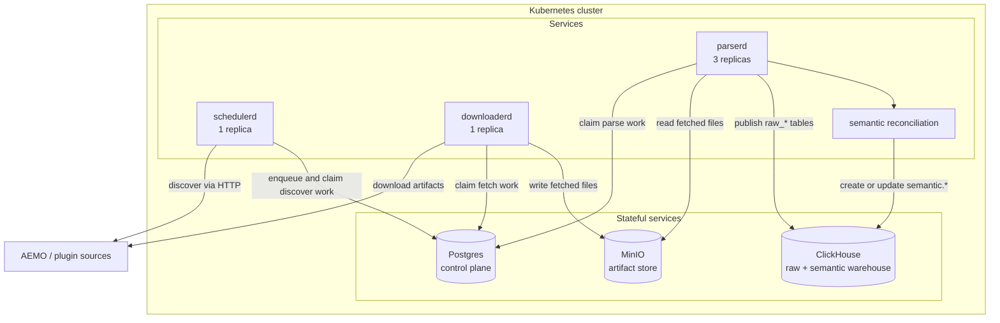
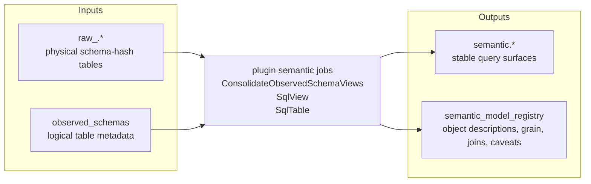
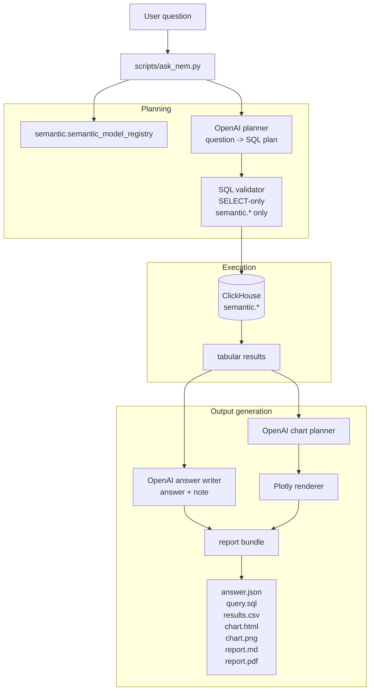

# energyhistorian

Rust-first energy market historisation platform, moving toward a Kubernetes-native control plane with separated scheduler, downloader, and parser services.

## What is here

- `apps/`
  - runnable Rust services
  - `schedulerd`, `downloaderd`, `parserd`
- `libs/`
  - reusable Rust libraries
  - source plugins stay here so execution topology can change without rewriting source semantics
- `deploy/helm/energyhistorian`
  - single-node `k3s` Helm chart with Postgres, MinIO, and the service deployments
- `docs/platform/k3s-control-plane.md`
  - target runtime model and migration phases
- `docs/schema-evolution-strategy.md`
  - hashed raw schema strategy and stable semantic view approach

## Architecture

### Kubernetes runtime

The runtime is split into three long-running services backed by Postgres for task coordination, MinIO for immutable fetched artifacts, and ClickHouse for raw and semantic analytics.

- `schedulerd`
  - owns collection schedules and enqueues `discover` work
- `downloaderd`
  - claims `fetch` tasks, downloads remote artifacts, and stores them in MinIO
- `parserd`
  - claims `parse` tasks, reads artifacts from MinIO, publishes raw tables into ClickHouse, and then reconciles semantic views for the affected source

Current local Helm defaults:

- scheduler replicas: `1`
- downloader replicas: `1`
- parser replicas: `3`



### Warehouse shape

The warehouse has two main layers:

- `raw_*`
  - append-only physical tables published directly from parsed artifacts
  - schema-hash variants are kept separate
- `semantic.*`
  - code-defined views and optional ETL jobs owned by each plugin
  - consolidates raw schema variants into stable query surfaces
  - examples:
    - NEMWEB logical views such as `semantic.daily_unit_dispatch`
    - MMSDM current-state dimension such as `semantic.unit_dimension`
    - `semantic.semantic_model_registry` for LLM-facing metadata

The semantic jobs are defined by source plugins and executed either:

- automatically after successful parse runs
- manually via `apps/reconcile-semantics`



### Question answering and report generation

`scripts/ask_nem.py` is the current dynamic answering harness. It treats the semantic layer as the allowed analytical surface, uses an OpenAI model to plan read-only SQL, executes the query in ClickHouse, and emits a report bundle.

The process is:

1. Load `.env`, connect to ClickHouse, and read `semantic.semantic_model_registry`
2. Ask the model to decide whether the question is answerable from `semantic.*`
3. Validate that the proposed SQL is read-only and only references allowed semantic objects
4. Run `EXPLAIN SYNTAX`, then execute the SQL in ClickHouse
5. If the query errors or returns no rows, retry with a repaired plan
6. Ask the model for an `answer`, `note`, and chart spec
7. Render a Plotly chart and write:
   - `answer.json`
   - `query.sql`
   - `results.csv`
   - `chart.html`
   - `chart.png`
   - `report.md`
   - `report.pdf`



### Why the semantic registry exists

The registry is intentionally small. It is not meant to replace the semantic layer; it tells the answering harness just enough to use the semantic layer safely:

- stable object name
- description
- grain
- time column
- dimensions and measures
- common join keys
- caveats
- question tags

That lets the LLM plan against `semantic.*` without reverse-engineering raw warehouse structures on every request.

## Quick start

Build the workspace:

```bash
cargo check
```

Run the local multi-service stack:

```bash
docker compose up --build
```

Service health endpoints:

```bash
curl http://127.0.0.1:18080/healthz
```

Deploy to local `k3s`:

```bash
docker build -t energyhistorian/energyhistorian:latest .
helm upgrade --install energyhistorian ./deploy/helm/energyhistorian
```

Local infrastructure endpoints:

- Postgres: `127.0.0.1:5432`
- MinIO API: `127.0.0.1:9002`
- MinIO console: `127.0.0.1:9001`
- ClickHouse HTTP: `127.0.0.1:8123`

The default dev credentials remain `energyhistorian` / `energyhistorian` for Postgres and ClickHouse, and `minio` / `minio123` for MinIO.

## Notes

- The long-term direction is service-first with Postgres as the operational control plane and S3-compatible object storage for immutable fetched artifacts.
- The source crates remain the core ingestion logic; the service split is around orchestration and execution roles.
- ClickHouse remains the analytical warehouse.
- The execution path now runs through the split services with Postgres task coordination, MinIO artifact storage, and ClickHouse publication.
